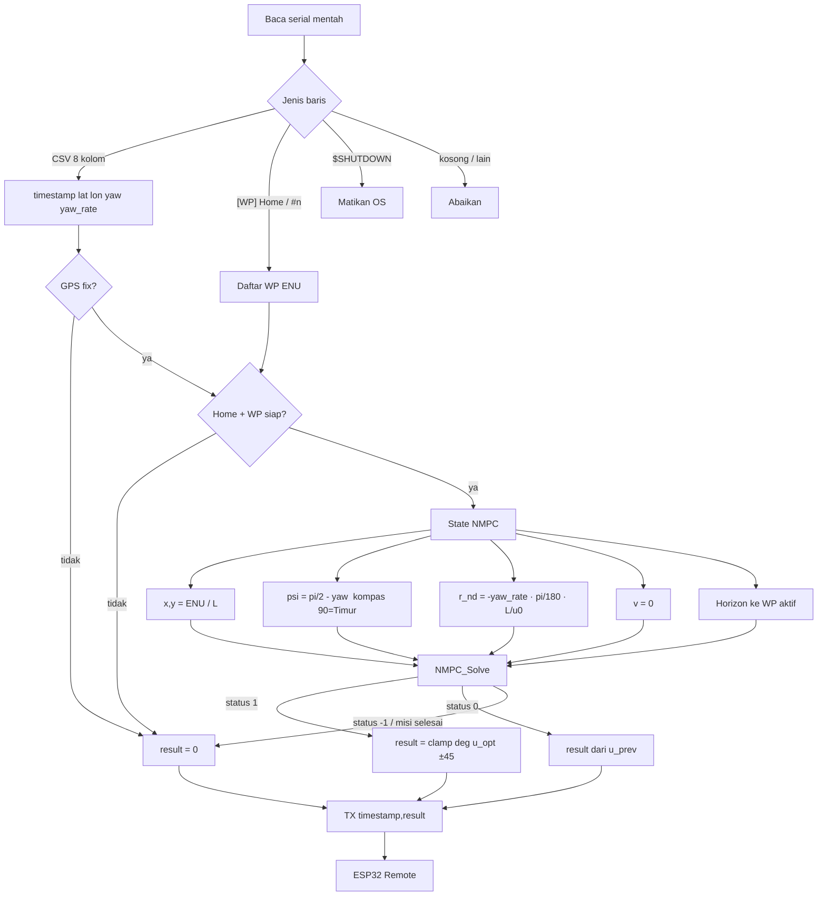
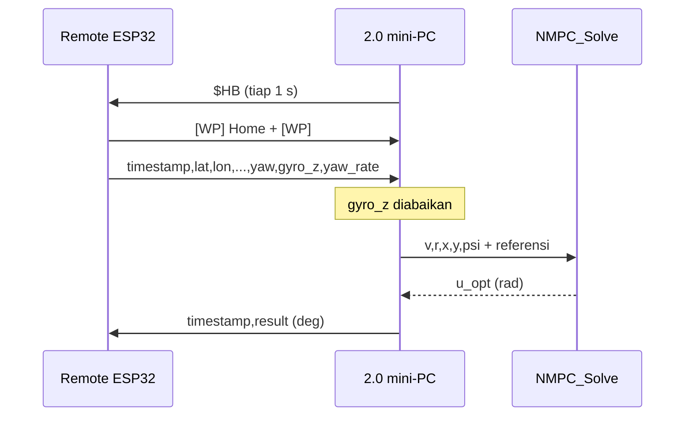

# Cpp_ReadWriteSerial-2.0-ENU-NMPC-beta

Bridge USB **1.2** (data mentah) + **NMPC C Sep 2026**. Keluaran ke ESP32 tetap `timestamp,result` (rudder derajat).

| Pasangan | Path |
|----------|------|
| Firmware Remote | `PlatformIO/Way_Points_Tracking/ESP-Now_ESP32-S3_Remote-Side-05` |
| Firmware User | `PlatformIO/Way_Points_Tracking/ESP-Now_ESP32-S3_User-Side-05` |
| Dashboard | `Pythonfile/Way_Points_Tracking/Local Monitor Dashboard-beta1.5.py` |
| Serial / CSV | `Cpp_Files/Cpp_ReadWriteSerial-1.2-ENU-beta` |
| Solver NMPC | `MPC NMPC Agus/Coding_NMPC_Sep2026/C code NMPC` |
| Simulasi (tanpa COM) | `Cpp_Files/Cpp_ReadWriteSerial-2.0-ENU-NMPC-simulasi` |

Remote-05 mengirim yaw **kompas CW**. `gyro_z` dan `calc_deg_servo_*` tidak dipakai solver. `v = 0`.

---

## Revisi — yaw kompas CW (0 = Utara, 90° = Timur)

Remote-05 mengirim **haluan kapal** kompas CW. 2.0 **tidak** menghitung `u`,`v`. Yang dipakai: `ψ` NMPC (0 = Timur, CCW) dari yaw CSV.

| | Sekarang |
|--|----------|
| `yaw` CSV | **0 = Utara, 90° = Timur, 270° = Barat** (CW) |
| `ψ` ke NMPC | **`π/2 − yaw`** |
| `r_nd` | **`−yaw_rate · π/180 · L/u0`** |
| `u`, `v` dari GPS | tidak dipakai (`v = 0`) |

```text
ψ_nmpc = wrap(π/2 − deg2rad(yaw))
```

Cek: `yaw = 0` → Utara → `ψ = π/2`. `yaw = 90°` → Timur → `ψ = 0`.

Kode: `src/main.cpp` — `compass_yaw_to_nmpc_psi()`, `yaw_rate_to_r_nd()`. Sama di simulasi `nmpc_tick.hpp`.

---

## Alur (Mermaid)






---

## Serial (sama 1.2)

**RX**

```text
timestamp,lat,lon,calc_deg_servo_1,calc_deg_servo_2,yaw,gyro_z,yaw_rate
[WP] Home: lat, lon
[WP] #1: lat, lon
$SHUTDOWN
```

**TX**

```text
$HB
24.783,12.40
```

---

## Adaptor mentah → NMPC

| Mentah | Dipakai? | Jadi |
|--------|----------|------|
| `timestamp` | ya | echo TX |
| `lat`, `lon` | ya | East, North → `x/L`, `y/L` |
| `yaw` ° kompas CW | ya | `ψ = π/2 − deg2rad(yaw)` (0 NMPC = Timur) |
| `yaw_rate` °/s | ya | `r_nd = −deg2rad(yaw_rate)·L/u0` |
| `[WP]` | ya | origin + target + horizon N=20 |
| `gyro_z` | **tidak** | — |
| `calc_deg_servo_*` | **tidak** | — |

### Konvensi heading IMU → NMPC

CSV `yaw` = Remote-05, **haluan kapal** kompas CW.

| `yaw` CSV | Haluan | `ψ` NMPC (0 = Timur, CCW) |
|----------:|--------|---------------------------|
| 0° | Utara | π/2 |
| 90° | **Timur** | 0 |
| 180° | Selatan | −π/2 |
| 270° | Barat | π |

```text
ψ_nmpc = wrap(π/2 − deg2rad(yaw))
```

Cek: `yaw = 0` → Utara = π/2; `yaw = 90°` → Timur = 0.

Karena `dψ/dt = −yaw_rate`, tanda `yaw_rate` **dibalik**.

Konstanta solver (demo C): `L=1.0107` m, `u0=0.6114` m/s, `T_sim=0.1` s, `N=20`, `r_tran=3` m, rudder ±45°.

Tanpa GPS fix, tanpa WP, atau misi selesai (`r_tran` di WP terakhir) → `result = 0`.

### Home, daftar WP, dan reset tracking

Home dari dashboard = origin ENU `(0,0)`, **bukan** target kaki pertama. Kaki pertama = **posisi CSV kapal sekarang → WP `#1`**.

`[WP]` bisa masuk saat RC masih manual (Remote echo `0xA1` ke USB). CSV (dan `NMPC_Solve`) hanya saat CH6 auto.

**CH6 manual ↔ auto tidak mereset** `active_idx`. Sudah lewat WP1–WP2, salah pencet manual lalu auto lagi → **lanjut WP3**, tidak ulang dari WP1.

Reset ke WP1 hanya jika:

- dashboard **Send Way Points** (baris `[WP] Home` mengosongkan daftar lalu `#n` di-`WP_Init` dari awal), atau
- `read_write_serial.exe` di-restart.

**Mengulang tracking dari WP1 (disarankan):**

1. CH6 → **manual**
2. Dashboard → **Send Way Points**
3. Cek stderr `[INFO] WP siap: N titik`
4. CH6 → **auto**

Jangan Send Way Points saat masih auto: NMPC langsung mengarah ke WP1.

Urutan biasa: 2.0 sudah jalan → Send Way Points (boleh manual) → CH6 auto.

---

## Build

```powershell
cd "Cpp_Files\Cpp_ReadWriteSerial-2.0-ENU-NMPC-beta"
g++ -std=c++17 -Iinclude -Inmpc src/main.cpp src/serial_port.cpp nmpc/nmpc_kapal_waypoint.c nmpc/geo_enu.c nmpc/waypoint_manager.c -o read_write_serial.exe
```

---

## Penggunaan

```powershell
.\read_write_serial.exe --port COM16 --baud 115200 --rudder-mode nmpc --print all
.\read_write_serial.exe --port COM16 --rudder-mode zero --print none
```

| Opsi | Default | Keterangan |
|------|---------|------------|
| `--port` | `COM16` | Port serial |
| `--baud` | `115200` | Baud |
| `--print` | `all` | `all` / `csv` / `wp` / `none` |
| `--rudder-mode` | `nmpc` | `nmpc`, `zero`, `yawrate2` |
| `--r-tran` | `3.0` | Radius ganti WP [m] |

Auto-start: [`startup_guide.md`](startup_guide.md).

Log stderr ~1 Hz: `[NMPC] WP2 d=4.2 m | E=... N=... | psi=... | d=12.4 deg | status=1`

---

## Catatan

1. Port COM hanya satu aplikasi.
2. `v` tidak diestimasi dari GPS (isi 0, seperti demo C).
3. Heading CSV: **0 = Utara, 90° = Timur** (kompas CW). Lihat **Revisi**: `ψ = π/2 − yaw`.
4. User Windows perlu hak `shutdown` untuk `$SHUTDOWN`.
5. Manual → auto tanpa kirim ulang WP = lanjut titik aktif, bukan ulang WP1.
